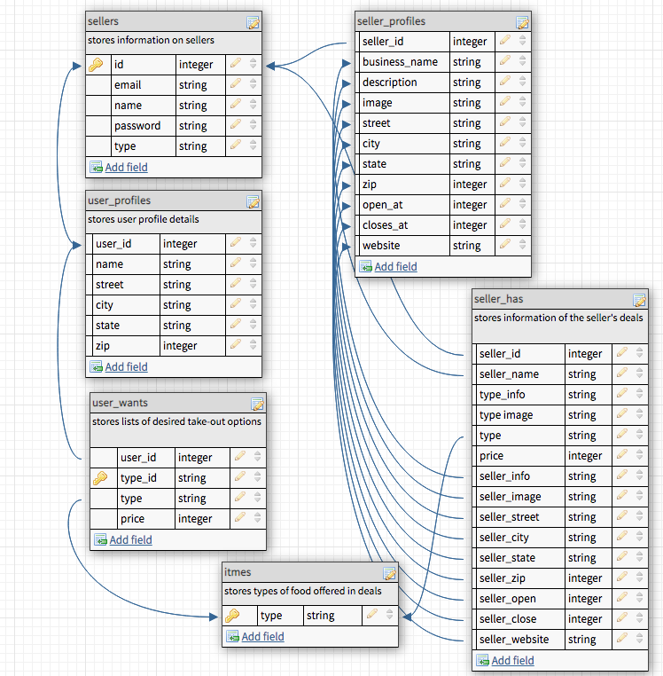

# FAMISHED
created by Lev Choubine <br/>
[gitHub Profile](https://github.com/lev-choubine)<br/>
[get the most recent code here](https://github.com/lev-choubine/Famished-test-two-users)<br/>


## Backstory
Famished is a software application that works with mobile and small scale food vendors. It allows these businesses to be seen by the application' user base. The core functionality of the apllication lies in it's ability to get user's prefferances for take-out and find all options registered within the application's databse within a set distance range.

## User Stories
As a user I want to be able to log into my account and set prefferances for take out - what it is (example: Burgers) and the desired price-range ($ 5). Once the user sets the parameters - the application will find all options registered in it's database within a set distance. The distance is currently a default of 5 kilometers for demonstation purpose - can be easily automated to be set by user in the future.  The user can update their address to search for options in diffrent areas, for example - if I have left my house and am at work at the momentand and want to find some quick cheap lunch.<br/>
As a vendor I want to be able update my location since I can park my food truck in deffirent areas on different days and at different times. I want to be able create Deals, for the users - advertising my best dishes and hopefully drumming up some business.

## How the app works
The application stores all information for the user's profiles vendor's profiles, user preffrences and vendor's deals into the application database. Once the user requests so see their options - the application filters out Deals that have the matching type (Burger) and price equal to or less then user's prefference. The application then uses to [Google Distance Matrix API](https://developers.google.com/maps/documentation/distance-matrix/overview#:~:text=The%20Distance%20Matrix%20API%20is%20a%20service%20that,containing%20duration%20and%20distance%20values%20for%20each%20pair.) to only display the items within the desired range. Easily put - if I live in New York - I will not see any inforamtion on vendors in California - no matter how cheap their deals are.

## Database Structure


We use 6 tables in this application. SELLERS table stores all information on app users - both sellers and buyes. The type column dicates the routing: either to seller or user profile types.<br/>
USER_PROFILES stores the address of our buyers that we will later user in our distace comparison logic. <br/>
SELLER_PROFILES stores informatioin on our sellers. We store the address for the same reason as mentioned above among profile images, description and other facts. <br/>
Both USER_PROFILES ans SELLER_PROFILES refference id from the SELLERS table.<br/>
ITEMS table stores types of food that we will use in our search. We are using 9 types for the demonstration of the app - however this can be later developed into hundreds of options to choose from. We are a database that will be rendered into a drop-down menu to ensure that if SELLERS are offering BURGERS and USERS are looking for BURGERS - they arrive at the same row in our database.<br/>
USER_WANTS stores information on items user is seraching for. We are passing down the ID from the USER_PROFILES table.<br/>
SELLER_HAS stores information on deals made the SELLER. We are pulling a lot of data from our SELLER_PROFILES table to later render in our SEARCH RESULTS page.

## API

### GOOGLE DISTANCE MATRIX
[Google Distance Matrix API](https://developers.google.com/maps/documentation/distance-matrix/overview#:~:text=The%20Distance%20Matrix%20API%20is%20a%20service%20that,containing%20duration%20and%20distance%20values%20for%20each%20pair.) <br/>
This API measures distance between 2 passed locations. See example for the JSON response.
```js
{
   "destination_addresses" : [ "New York, NY, USA" ],
   "origin_addresses" : [ "Washington, DC, USA" ],
   "rows" : [
      {
         "elements" : [
            {
               "distance" : {
                  "text" : "225 mi",
                  "value" : 361715
               },
               "duration" : {
                  "text" : "3 hours 49 mins",
                  "value" : 13725
               },
               "status" : "OK"
            }
         ]
      }
   ],
   "status" : "OK"
}
```

API: <br/>
https://maps.googleapis.com/maps/api/distancematrix/json?units=imperial&origins=Washington,DC&destinations=New+York+City,NY&key=YOUR_API_KEY

Inputs for the API | 
------ | 
Destination Street  | 
Destination City  | 
Destination State  | 
Destination ZIP  | 
Origin Street  | 
Origin  City | 
Origin  State | 
Origig  ZIP | 
<br/>

### CLOUDINARY
[Cloudinary](https://cloudinary.com/)
We will use this cloud server to store profile images and post the provided links into our database. <br/>

Register your account.<br/>

API Environment variable:<br/>	
CLOUDINARY_URL=cloudinary://***************:***************************<br/>	
Copy to clipboard<br/>	
select COPY TO CLIPBOARD file and paste it into your .env file. This will automatically be refferenced by the code in the node module.

## ROUTES

Method | Path | Location| Purpose 
------ | ------ | ------ | ------
GET   | /  | server.js  | Homepage
GET  | profile  | server.js  | User's profile
GET  | profile/finds   | server.js  | Search results
GET  | auth/signip   | auth.js  | Sign up page
GET  | auth/login  | auth.js   | Login Page
POST  | auth/signup  | auth.js  | Stores Auth details
GET | auth/user_address   | auth.js   | User profile details form  
GET   | auth/seller_address   | auth.js  | Seller profile details form
POST   | auth/login  | auth.js   | Logs user in
GET  | auth/logout  | auth.js  | Logs user out
POST  | address/user_address  | address.js   | Creates user address for the buyer's profile
PUT   | address/profile   |address.js  | Updates address for buyers
DELETE | address/profile | address.js | Deletes user's choices
POST  | seller_address/profile  | seller_address.js  | Creates user address for sellers
PUT  | seller_address/profile  | seller_address.js  | Updates user address for sellers
DELETE | seller_address/profile  | seller_address.js  | Deletes DEALs made by user.
POST  | seller_address//profile_profilepic  | seller_address.js  | Stores or updates seller's profile picture
POST  | seller_address//profile_foodpic | seller_address.js  | Stores or updates seller's DEAL picture
POST  | seller_food/profile  | seller_food.js   | Creates and stores seller's DEALS
POST   | user_food/profile   | user_food.js | Creates user's choices for the buyer

## SEEDER FILE

food_items.js <br/>

imports types (of FOOD) into our ITEMS table

```js
{ type: 'Ramen',
        createdAt: new Date(),
        updatedAt: new Date()
      },
{ type: 'Sushi',
        createdAt: new Date(),
        updatedAt: new Date()
      },
```

## CODE

server.js <br/>

The application does it's search for matches and posts them on the FINDS page. <br/>
STEP 1: SELECT DEALS from the SELLER_HAS database that has it's TYPE (foods) matching with USER_WANTS and the price of SELLER_HAS items lower then USER_WANTS.<br/>
STEP 2: GET the distance between SELLERS and USERS and filter out SELLER DEALS within a set distance range.


```js
app.get('/profile/finds', async (req,res) => {
  let distance;
  let range = 12;
    ////////////////////////////////////////////////////////////////////////////////////////
    //////////////////         Matching Options By Price              ////////////////////////////////////////////////////////////////////////////////////////////////////////////
  const picks = await db.user_wants.findAll({
    where: {user_id : req.user.id}
  })
  let found = []
 for (let i=0; i <picks.length; i++){
    const find = await  db.seller_has.findAll({
      where: {type: picks[i].type, price:{[Op.lte]:picks[i].price}}
    })
    if(find[0] !== undefined ){
      
      let userProfile = await db.user_profile.findOne({
        where: {user_id : req.user.id}
      })
      let street = plusWord(userProfile.dataValues.street);
      let city = plusWord(userProfile.dataValues.city);
      let state = plusWord(userProfile.dataValues.state);
      let zip =userProfile.dataValues.zip
      /////////////////////////////////////////////////////
      //////////////////////////////////////////////////////////  
      for(let a =0; a <find.length; a++){
      /////////////////////////////////////////////////
      let id = find[a].seller_id
      console.log(JSON.stringify(find[a]))
      let sellerProfile = await db.seller_profile.findOne({
        where: {seller_id : id} 
      })
      ///////////////get seller ADRESS details to run the API////////////////
      let streetSeller = plusWord(sellerProfile.dataValues.street);
      let citySeller = plusWord(sellerProfile.dataValues.city);
      let stateSeller = plusWord(sellerProfile.dataValues.state);
      let zipSeller =sellerProfile.dataValues.zip
      let distanceURL = "https://maps.googleapis.com/maps/api/distancematrix/json?origins="+street+"+"+city+","+state+"+"+zip+"&destinations="+streetSeller+"+"+citySeller+","+stateSeller+"+"+zipSeller+"&key="+API_KEY;
      ////////////////////////////////////////////////////////
   await axios.get(distanceURL )
   .then(async response => {
     let apiResults = await response.data.rows[0].elements[0].distance.text
     let reso = await apiResults.slice(0,apiResults.length-3);
     distance = await parseFloat(reso)
     console.log('##########&&&&&&&&'+distance);
     return distance;
   }).catch(err=>{console.log(err)
    res.render('error')});
      if(distance < range) {
        //pulls seller's address
         find[a].seller_street = await sellerProfile.street
         find[a].seller_city = await sellerProfile.city
         find[a].seller_state = await sellerProfile.state
         find[a].seller_zip = await sellerProfile.zip
         find[a].seller_website = await sellerProfile.website
         found=found.concat(find[a]) 
         //////////////////////////////////////////////////////
      }
    }
  }else{
  } 
  }
    res.render('finds', {found})  
  })
```
