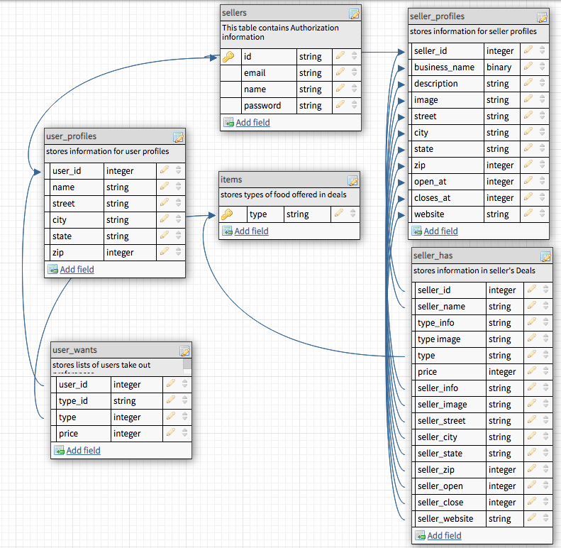

# FAMISHED
created by Lev Choubine  
[gitHub Profile](https://github.com/lev-choubine) 
[get the most recent code here](https://github.com/lev-choubine/Famished-test-two-users) 

## Backstory
Famished is a software application that works with mobile and small scale food vendors. It allows these businesses to be seen by the application' user base. The core functionality of the apllication lies in it's ability to get user's prefferances for take-out and find all options registered within the application's databse within a set distance range.

## User Stories
As a user I want to be able to log into my account and set prefferances for take out - what it is (example: Burgers) and the desired price-range ($ 5). Once the user sets the parameters - the application will find all options registered in it's database within a set distance. The distance is currently a default of 5 kilometers for demonstation purpose - can be easily automated to be set by user in the future.  The user can update their address to search for options in diffrent areas, for example - if I have left my house and am at work at the momentand and want to find some quick cheap lunch. 
As a vendor I want to be able update my location since I can park my food truck in deffirent areas on different days and at different times. I want to be able create Deals, for the users - advertising my best dishes and hopefully drumming up some business.

## How the app works
The application stores all information for the user's profiles vendor's profiles, user preffrences and vendor's deals into the application database. Once the user requests so see their options - the application filters out Deals that have the matching type (Burger) and price equal to or less then user's prefference. The application then uses to [Google Distance Matrix API](https://developers.google.com/maps/documentation/distance-matrix/overview#:~:text=The%20Distance%20Matrix%20API%20is%20a%20service%20that,containing%20duration%20and%20distance%20values%20for%20each%20pair.) to only display the items within the desired range. Easily put - if I live in New York - I will not see any inforamtion on vendors in California - no matter how cheap their deals are.

## Database Structure

